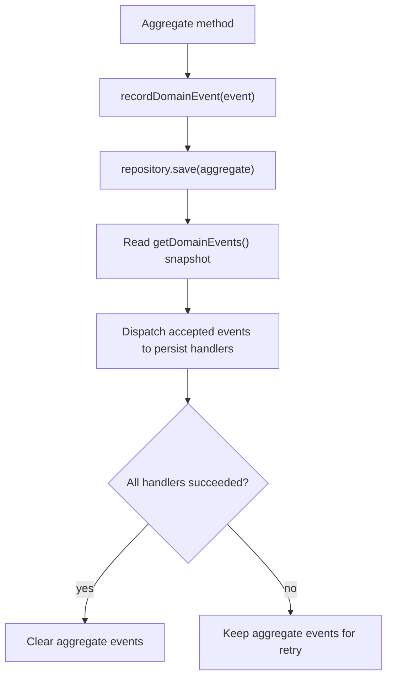

# @codeva-dev/domain-model-kit

Domain encapsulation and domain-event persistence toolkit for TypeScript.

Current status: alpha package. The package is published, tested, and usable for feedback-driven adoption, but the public API should still be treated as unstable until `1.0.0`.

## 1. Common Model

Most TypeScript backends start simple: a few services, a few repositories, some DTO validation, and direct database calls. As the product grows, business rules often spread across controllers, service functions, repository methods, validators, and persistence adapters.

That creates recurring problems:

- domain rules become implicit and hard to find
- invariants are enforced inconsistently
- persistence code knows too much about business decisions
- repositories grow large `saveSomething(...)` method forests
- tests need too much infrastructure to verify simple domain behavior
- ORM dirty tracking is either unavailable, leaky, or not the modeling tool you want

`@codeva-dev/domain-model-kit` is built around a different shape: model the domain explicitly, record meaningful domain events when aggregate state changes, and let repositories dispatch those events to narrow persist handlers.

The domain model becomes the stable center of the application. Storage, queues, caches, files, external APIs, framework adapters, runtime layers, and transport DTOs stay outside of it.

### Install

```bash
npm install @codeva-dev/domain-model-kit@alpha
```

Public imports are exposed through subpath exports:

```ts
import { AggregateRoot, DomainEvent, Repository } from "@codeva-dev/domain-model-kit/pure"
import { AggregateRoot, DomainEvent, Repository } from "@codeva-dev/domain-model-kit/neverthrow"
import { AggregateRoot, DomainEvent, Repository } from "@codeva-dev/domain-model-kit/effect"
```

Each implementation is intentionally separate. They share naming and mental model, but they do not share a runtime core.

### What This Package Does

- **Domain logic encapsulation:** behavior lives on entities and aggregate roots instead of being scattered through service code.
- **Domain logic strictness:** value objects, aggregate event boundaries, and explicit errors make invalid states harder to represent accidentally.
- **Persistence decoupling:** aggregates record what happened; persist handlers decide how those changes map to storage.
- **Application logic testability:** most domain and application flows can be tested without mocking the whole infrastructure stack.
- **Storage-agnostic persistence strategy:** the same aggregate events can be persisted to memory, files, Redis, SQL databases, event stores, outbox tables, or external APIs.
- **Explicit event lifecycle:** events are recorded by the aggregate, dispatched by the repository, and cleared only after successful persistence.
- **Less persistence boilerplate:** the generated repository `save(...)` handles event dispatch consistently for every aggregate.
- **Architecture-friendly persistence:** the persistence pipeline works well inside transaction boundaries and does not block outbox, event sourcing, or CQRS-style designs.

### Non-Goals

- This is not an ORM.
- This is not a full application framework.
- This is not a full event sourcing framework.
- This is not a transaction manager.
- This is not an outbox storage adapter.
- This does not decide your HTTP, queue, telemetry, retry, logging, or database strategy.

Those concerns should live outside this library or in separate adapters.

### Recommended Flow

In application code, the usual write flow is:

1. Open an application-level transaction boundary.
2. Load the aggregate and related read data needed to evaluate rules.
3. Call domain methods on the aggregate.
4. Call `repository.save(aggregate)` inside the same boundary.
5. Let persist handlers update storage, insert outbox rows, append event records, or update CQRS projections.

The package does not provide the transaction boundary itself. That boundary should come from your database, Effect layer, application service, framework adapter, or infrastructure code.

Recorded domain events are normal application data at the persistence boundary. A persist handler can map them to direct table updates, outbox messages, event store appends, read-model updates, or a combination of those patterns.

### Shared Concepts

`ValueObject` wraps a validated immutable value. Equality is structural, not identity-based. In `pure` and `neverthrow`, value objects use zod schemas. In `effect`, value objects use Effect Schema.

`Entity` is a domain object identified by an ID, not by all of its properties. Use it for objects with identity that are not aggregate roots.

`AggregateRoot` is an entity that represents a consistency boundary. It is the object through which the aggregate is modified, and it records domain events.

`DomainEvent` describes something meaningful that happened in the domain. Serialized events have this conceptual shape:

```ts
{
  eventKey: "order.created",
  instanceId: "...",
  occurredAt: "2026-05-15T12:00:00.000Z",
  payload: {}
}
```

`PersistHandler` declares which event classes it accepts and persists accepted events in batch. Handlers do not own retry, transactions, telemetry, or outbox policy.

`Repository` is an event-dispatching persistence repository. It is not a classic ORM repository and not a full event sourcing repository. Its generated `save()` method:

1. Takes one aggregate root.
2. Reads a snapshot of recorded domain events.
3. Dispatches events to persist handlers sequentially.
4. Preserves event order and handler order.
5. Calls handlers with accepted events in batch.
6. Clears aggregate events only after all handlers succeeded.
7. Leaves events on the aggregate if persistence fails.

Saving an aggregate with zero events is a no-op success.

### Event Lifecycle



This lifecycle is the main reason for the library. The aggregate tells the persistence layer what changed by recording business events. The repository does not need a large hand-written save function and does not need ORM dirty tracking.

### Shared Error Names

Each implementation exports the same main error names:

- `UnknownDomainError`
- `DomainValidationError`
- `DomainInvariantError`
- `ValueObjectValidationError`
- `DomainEventValidationError`
- `DomainPersistenceError`
- `DomainConcurrencyError`

There is no shared custom error inheritance hierarchy. The errors have matching conceptual shape, but they are implemented separately per implementation.

Current usage:

- `ValueObject` validation uses `ValueObjectValidationError`.
- `DomainEvent` create/decode/encode validation uses `DomainEventValidationError`.
- `AggregateRoot` invariant and event-boundary failures use `DomainInvariantError`.
- `Repository` and `PersistHandler` do not wrap handler errors.

### Complete Examples And Verification

Complete examples:

- [`src/examples/order-pure.ts`](./src/examples/order-pure.ts)
- [`src/examples/order-neverthrow.ts`](./src/examples/order-neverthrow.ts)
- [`src/examples/order-effect.ts`](./src/examples/order-effect.ts)
- [`src/examples/value-object-examples.ts`](./src/examples/value-object-examples.ts)

Verification commands:

```bash
npm run typecheck
npm run test
npm run build
```

The test suite covers the pure, neverthrow, and Effect implementations with coverage thresholds enforced by Vitest.

## 2. Pure

Use `pure` when you want the smallest API surface and your project already uses exceptions for expected domain errors.

The pure implementation uses:

- zod schemas
- direct return values
- exceptions for expected domain failures
- class-based `Repository.Class(...)` and `PersistHandler.Class(...)`
- optional context override on `repository.save(aggregate, context)`

### Example

```ts
import z4 from "zod/v4"
import {
  AggregateRoot,
  DomainEvent,
  DomainInvariantError,
  DomainPersistenceError,
  PersistHandler,
  Repository,
  ValueObject,
} from "@codeva-dev/domain-model-kit/pure"

const OrderIdSchema = z4.uuidv4().brand("OrderId")
type OrderId = z4.infer<typeof OrderIdSchema>

const SkuSchema = z4.string().min(1).brand("Sku")
class Sku extends ValueObject.Class(SkuSchema) {}

class OrderCreated extends DomainEvent.Class(
  "order.created",
  z4.object({
    orderId: OrderIdSchema,
    sku: SkuSchema,
  }),
) {}

type OrderRow = {
  id: OrderId
  sku: string
}

type DbContext = {
  orders: Map<OrderId, OrderRow>
}

class Order extends AggregateRoot.Class<OrderId>()(OrderCreated) {
  private constructor(
    id: OrderId,
    public readonly sku: Sku,
  ) {
    super(id)
  }

  static create(props: { id: OrderId; sku: Sku }) {
    if (!props.sku.value) {
      throw new DomainInvariantError("Order must have a SKU")
    }

    const order = new Order(props.id, props.sku)

    order.recordDomainEvent(
      OrderCreated.create({
        instanceId: order.id,
        payload: { orderId: order.id, sku: order.sku.value },
      }),
    )

    return order
  }
}

class OrderPersistHandler extends PersistHandler.Class({
  accepts: [OrderCreated],
  handle(events, db: DbContext) {
    for (const event of events) {
      db.orders.set(event.payload.orderId, {
        id: event.payload.orderId,
        sku: event.payload.sku,
      })
    }
  },
}) {}

class OrderRepository extends Repository.Class({
  dbContext: { orders: new Map() } satisfies DbContext,
  persistHandlers: [new OrderPersistHandler()],
}) {
  findById(id: OrderId) {
    const row = this.dbContext.orders.get(id)
    if (!row) throw new DomainPersistenceError("Order not found")
    return row
  }
}

const repository = new OrderRepository()
const order = Order.create({ id: orderId, sku: Sku.create("SKU-1") })

await repository.save(order)
```

Use the context override when a transaction provides the current context:

```ts
await repository.save(order, transactionContext)
```

## 3. Neverthrow

Use `neverthrow` when you want explicit typed success/failure values without committing to Effect.

The neverthrow implementation uses:

- zod schemas
- `Result` for synchronous creation/validation
- `ResultAsync` for persistence
- class-based `Repository.Class(...)` and `PersistHandler.Class(...)`
- optional context override on `repository.save(aggregate, context)`

### Example

```ts
import z4 from "zod/v4"
import { err, ok, okAsync, ResultAsync } from "neverthrow"
import {
  AggregateRoot,
  DomainEvent,
  DomainInvariantError,
  DomainPersistenceError,
  PersistHandler,
  Repository,
} from "@codeva-dev/domain-model-kit/neverthrow"

const OrderIdSchema = z4.uuidv4().brand("OrderId")
type OrderId = z4.infer<typeof OrderIdSchema>

class OrderCreated extends DomainEvent.Class(
  "order.created",
  z4.object({
    orderId: OrderIdSchema,
  }),
) {}

type DbContext = {
  orders: Map<OrderId, { id: OrderId }>
}

class Order extends AggregateRoot.Class<OrderId>()(OrderCreated) {
  private constructor(id: OrderId) {
    super(id)
  }

  static create(id: OrderId) {
    const order = new Order(id)
    const event = OrderCreated.create({
      instanceId: order.id,
      payload: { orderId: order.id },
    })

    if (event.isErr()) return err(event.error)

    order.recordDomainEvent(event.value)
    return ok(order)
  }
}

class OrderPersistHandler extends PersistHandler.Class({
  accepts: [OrderCreated],
  handle(events, db: DbContext) {
    for (const event of events) {
      db.orders.set(event.payload.orderId, { id: event.payload.orderId })
    }

    return okAsync(undefined)
  },
}) {}

class OrderRepository extends Repository.Class({
  dbContext: { orders: new Map() } satisfies DbContext,
  persistHandlers: [new OrderPersistHandler()],
}) {
  findById(id: OrderId) {
    const row = this.dbContext.orders.get(id)
    return row ? ok(row) : err(new DomainPersistenceError("Order not found"))
  }
}

const repository = new OrderRepository()
const created = Order.create(orderId)

const saved = created.asyncAndThen((order) => repository.save(order))
```

Persist handlers may return one `Result`, one `ResultAsync`, or an array of them. The repository normalizes them into a sequential `ResultAsync<void, ErrorUnion>`.

## 4. Effect

Use `effect` when your application already uses Effect or you want typed services, typed dependencies, Effect Schema, and generator-based composition.

The Effect implementation uses:

- Effect Schema
- `Effect.Effect` for creation, validation, loading, and persistence
- `DomainError.Class(...)` for independent `Schema.TaggedError` classes
- class-first `Repository.Service<Self>()(...)`
- class-first `PersistHandler.Service<Self>()(...)`
- Effect service dependencies through `Default` layers

### Domain Errors

Effect errors are independent `Schema.TaggedError` classes created with `DomainError.Class(...)`.
The returned class keeps the Effect Schema class surface, so it can be passed to helpers that accept schema-backed tagged errors and can also be yielded as an Effect failure.
When fields are omitted, the public schema is `{ message: string }`; raw `cause` values are intentionally not part of the default encoded payload.

```ts
import { Schema } from "effect"
import { DomainError } from "@codeva-dev/domain-model-kit/effect"

const OrderRejected = DomainError.Class("OrderRejected", {
  message: Schema.String,
  orderId: Schema.String,
})

yield* new OrderRejected({
  message: "Order is invalid",
  orderId,
})
```

### Repository And Persist Handler

This example follows an order flow: the aggregate records order events, the generated `save(...)` method dispatches them, and the persist handler writes the storage changes.

```ts
import {
  AggregateRoot,
  DomainError,
  DomainEvent,
  PersistHandler,
  Repository,
} from "@codeva-dev/domain-model-kit/effect"
import { Effect, Schema } from "effect"

class OrderDb extends Effect.Service<OrderDb>()("OrderDb", {
  accessors: true,
  sync: () => ({
    orders: new Map<string, { id: string; items: readonly string[] }>(),
  }),
}) {}

const OrderIdSchema = Schema.String.pipe(Schema.brand("OrderId"))
type OrderId = typeof OrderIdSchema.Type

const OrderCreated = DomainEvent.Class(
  "order.created",
  Schema.Struct({
    orderId: OrderIdSchema,
    items: Schema.Array(Schema.String),
  }),
)
type OrderCreated = InstanceType<typeof OrderCreated>

const OrderItemAdded = DomainEvent.Class(
  "order.item-added",
  Schema.Struct({
    orderId: OrderIdSchema,
    item: Schema.String,
  }),
)
type OrderItemAdded = InstanceType<typeof OrderItemAdded>

const OrderEvents = [OrderCreated, OrderItemAdded] as const

const EmptyOrderError = DomainError.Class("EmptyOrderError")
const OrderNotFound = DomainError.Class("OrderNotFound")

class Order extends AggregateRoot.Class<OrderId>()(...OrderEvents) {
  private constructor(
    id: OrderId,
    public readonly items: readonly string[],
  ) {
    super(id)
  }

  static create(props: { id: OrderId; items: readonly string[] }) {
    return Effect.gen(function* () {
      if (props.items.length === 0) {
        return yield* new EmptyOrderError({ message: "Order must have at least one item" })
      }

      const order = new Order(props.id, props.items)

      order.recordDomainEvent(
        yield* OrderCreated.create({
          instanceId: order.id,
          payload: { orderId: order.id, items: [...order.items] },
        }),
      )

      return order
    })
  }

  static hydrate(props: { id: OrderId; items: readonly string[] }) {
    return Effect.succeed(new Order(props.id, props.items))
  }

  addItem(item: string) {
    return Effect.gen(this, function* () {
      const order = new Order(this.id, [...this.items, item])

      order.recordDomainEvent(
        yield* OrderItemAdded.create({
          instanceId: order.id,
          payload: {
            orderId: order.id,
            item,
          },
        }),
      )

      return order
    })
  }
}

class OrderPersistHandler extends PersistHandler.Service<OrderPersistHandler>()(
  "OrderPersistHandler",
  {
    accepts: OrderEvents,
    dependencies: [OrderDb.Default],
    handle(events) {
      return Effect.gen(function* () {
        const db = yield* OrderDb

        for (const event of events) {
          switch (event.eventKey) {
            case "order.created":
              db.orders.set(event.payload.orderId, {
                id: event.payload.orderId,
                items: [...event.payload.items],
              })
              break

            case "order.item-added": {
              const order = db.orders.get(event.payload.orderId)
              if (!order) return yield* Effect.dieMessage("Persisted order not found")

              db.orders.set(event.payload.orderId, {
                ...order,
                items: [...order.items, event.payload.item],
              })
              break
            }
          }
        }
      })
    },
  },
) {}

class OrderRepository extends Repository.Service<OrderRepository>()("OrderRepository", {
  persistHandlers: [OrderPersistHandler],
  dependencies: [OrderDb.Default, OrderPersistHandler.Default],
}) {
  findById(id: OrderId) {
    return Effect.gen(function* () {
      const db = yield* OrderDb
      const row = db.orders.get(id)

      if (!row) {
        return yield* new OrderNotFound({ message: "Order not found" })
      }

      return yield* Order.hydrate(row)
    })
  }
}
```

Custom repository methods live in the class body. The generated `save(...)` method is reserved and cannot be overridden.

`dependencies` should contain the `Default` layers needed to build the service. When all construction dependencies are listed there, the generated service `Default` layer is self-contained and can be merged into an application runtime without leaking those construction requirements to the outer layer type.

Persist handlers should resolve database/context services inside the returned `handle(...)` Effect. This keeps transaction-aware services correct: when `repository.save(...)` runs inside a transaction boundary, handlers read the DB service from the current Effect context at handler execution time.

### Command Flow

```ts
const PlaceOrder = (input: { orderId: OrderId; items: readonly string[] }) =>
  Effect.gen(function* () {
    const repository = yield* OrderRepository

    const order = yield* runInTransaction(
      Effect.gen(function* () {
        const order = yield* Order.create({
          id: input.orderId,
          items: input.items,
        })

        yield* repository.save(order)

        return order
      }),
    )

    return { orderId: order.id }
  })
```

The repository does not decide order policy. It loads and persists aggregate state. Business invariants, such as whether an order can be created or changed, belong in the aggregate.

`runInTransaction(...)` represents your own application/database transaction helper. It is not provided by this package.

Infrastructure, query, decode, and consistency errors that are not recoverable application failures should be defects (`Effect.die`, `Effect.orDie`, or equivalent adapter-level handling), not command failure values. The command error channel should stay focused on recoverable domain/application failures.
