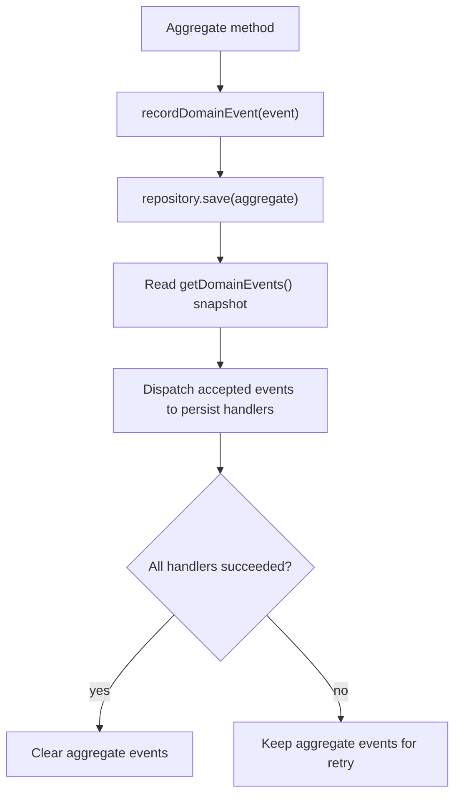

# @codeva-dev/domain-model-kit

Domain encapsulation and domain-event persistence toolkit for TypeScript.

This package helps you keep business rules inside the domain model and persistence details outside of it. It is not an ORM, not a full application framework, and not a full event sourcing framework. It is a small set of building blocks for explicit domain models, strict domain rules, and persistence driven by recorded domain events.

Current status: alpha package. The package is published, tested, and usable for feedback-driven adoption, but the public API should still be treated as unstable until `1.0.0`.

## The Problem

Most TypeScript backends start simple: a few services, a few repositories, some DTO validation, and direct database calls. As the product grows, the business logic often spreads across controllers, service functions, repository methods, validators, and persistence adapters.

That creates recurring problems:

- domain rules become implicit and hard to find
- invariants are enforced inconsistently
- persistence code knows too much about business decisions
- repositories grow large `saveSomething(...)` method forests
- tests need too much infrastructure to verify simple domain behavior
- ORM dirty tracking is either unavailable, leaky, or not the modeling tool you want

`@codeva-dev/domain-model-kit` is built around a different shape: model the domain explicitly, record meaningful domain events when aggregate state changes, and let repositories dispatch those events to narrow persist handlers.

The domain model becomes the stable center of the application. Storage, queues, caches, files, external APIs, and framework adapters become replaceable delivery and persistence details around it.

## What You Get

- **Domain logic encapsulation:** behavior lives on entities and aggregate roots instead of being scattered through service code.
- **Domain logic strictness:** value objects, aggregate event boundaries, and explicit errors make invalid states harder to represent accidentally.
- **Persistence decoupling:** aggregates record what happened; persist handlers decide how those changes map to storage.
- **Application logic testability:** most domain and application flows can be tested without mocking the whole infrastructure stack.
- **Storage-agnostic persistence strategy:** the same aggregate events can be persisted to memory, files, Redis, SQL databases, event stores, outbox tables, or even external APIs.
- **Explicit event lifecycle:** events are recorded by the aggregate, dispatched by the repository, and cleared only after successful persistence.
- **Less persistence boilerplate:** the generated repository `save(...)` handles event dispatch consistently for every aggregate.
- **Architecture-friendly persistence:** the persistence pipeline works well inside transaction boundaries and does not block outbox, event sourcing, or CQRS-style designs.

That means a use case can be tested against domain objects and small fake persist handlers instead of a mocked database driver, mocked HTTP client, mocked queue producer, and half of your framework runtime. The test can focus on the question that matters: given this state and this command, which domain decision is made and which persistence events are produced?

## Non-Goals

- This is not an ORM.
- This is not a full application framework.
- This is not a full event sourcing framework.
- This is not a transaction manager.
- This is not an outbox storage adapter.
- This does not decide your HTTP, queue, telemetry, retry, logging, or database strategy.

Those concerns should live outside this library or in separate adapters. The package is designed to leave those choices open rather than hide them behind a framework-level abstraction.

## Recommended Usage Shape

In application code, the usual shape is:

1. Open an application-level transaction boundary.
2. Load the aggregate and related read data needed to evaluate rules.
3. Call domain methods on the aggregate.
4. Call `repository.save(aggregate)` inside the same boundary.
5. Let persist handlers update storage, insert outbox rows, append event records, or update CQRS projections as needed.

The package does not provide the transaction boundary itself. That boundary should come from your database, Effect layer, application service, framework adapter, or infrastructure code.

Recorded domain events are normal application data at the persistence boundary. A persist handler can map them to direct table updates, outbox messages, event store appends, read-model updates, or a combination of those patterns.

The storage target is deliberately not special. A persist handler can write to an in-memory map during tests, append JSON lines to a file for a prototype, update Redis for a fast projection, persist rows through a database client, call a remote API, insert outbox records, or append to an event store. The aggregate does not change when that strategy changes.

## Install Shape

Install the alpha package:

```bash
npm install @codeva-dev/domain-model-kit@alpha
```

Public imports are exposed through subpath exports:

```ts
import { AggregateRoot, DomainEvent, Repository } from "@codeva-dev/domain-model-kit/pure"
import { AggregateRoot, DomainEvent, Repository } from "@codeva-dev/domain-model-kit/neverthrow"
import { AggregateRoot, DomainEvent, Repository } from "@codeva-dev/domain-model-kit/effect"
```

Each implementation is intentionally separate. They share naming and mental model, but they do not share a runtime core.

## Choosing an Implementation

Use `pure` when you want the smallest API surface and your project already uses exceptions for expected domain errors.

Use `neverthrow` when you want explicit typed success/failure values without committing to Effect.

Use `effect` when your application already uses Effect or you want typed services, typed dependencies, Effect Schema, and generator-based composition.

The `effect` implementation is the primary long-term direction. The `pure` and `neverthrow` implementations are kept as separate variants for teams that prefer those styles.

## Real-World Example: Library Loans

This compact example uses the native TypeScript `pure` implementation. It models three bounded contexts:

- `User`: a user must be active to borrow books
- `Book`: a book must be available to be borrowed
- `Loan`: the aggregate that enforces borrowing and returning rules

The loan rules are intentionally simple but realistic:

- only active users can borrow
- only available books can be borrowed
- a user can have at most 3 active loans
- overdue loans block new borrowing
- only an active loan can be returned

```ts
import z4 from "zod/v4"
import {
  AggregateRoot,
  DomainEvent,
  DomainInvariantError,
  DomainPersistenceError,
  Entity,
  PersistHandler,
  Repository,
} from "@codeva-dev/domain-model-kit/pure"

const UserIdSchema = z4.uuidv4().brand("UserId")
type UserId = z4.infer<typeof UserIdSchema>

const BookIdSchema = z4.uuidv4().brand("BookId")
type BookId = z4.infer<typeof BookIdSchema>

const LoanIdSchema = z4.uuidv4().brand("LoanId")
type LoanId = z4.infer<typeof LoanIdSchema>

class User extends Entity.Class<UserId>() {
  public constructor(
    id: UserId,
    public readonly status: "active" | "suspended",
  ) {
    super(id)
  }

  public get canBorrow() {
    return this.status === "active"
  }
}

class Book extends Entity.Class<BookId>() {
  public constructor(
    id: BookId,
    public readonly status: "available" | "loaned",
  ) {
    super(id)
  }

  public get isAvailable() {
    return this.status === "available"
  }
}

class LoanStarted extends DomainEvent.Class(
  "loan.started",
  z4.object({
    loanId: LoanIdSchema,
    userId: UserIdSchema,
    bookId: BookIdSchema,
    dueAt: z4.date(),
  }),
) {}

class LoanReturned extends DomainEvent.Class(
  "loan.returned",
  z4.object({
    loanId: LoanIdSchema,
    returnedAt: z4.date(),
  }),
) {}

type ActiveLoanSummary = {
  loanId: LoanId
  dueAt: Date
}

class Loan extends AggregateRoot.Class<LoanId>()(LoanStarted, LoanReturned) {
  private constructor(
    id: LoanId,
    public readonly userId: UserId,
    public readonly bookId: BookId,
    public readonly status: "active" | "returned",
    public readonly dueAt: Date,
    public readonly returnedAt?: Date,
  ) {
    super(id)
  }

  public static start(props: {
    loanId: LoanId
    user: User
    book: Book
    activeLoansForUser: readonly ActiveLoanSummary[]
    now: Date
    dueAt: Date
  }) {
    if (!props.user.canBorrow) {
      throw new DomainInvariantError("Only active users can borrow books")
    }

    if (!props.book.isAvailable) {
      throw new DomainInvariantError("Only available books can be borrowed")
    }

    if (props.activeLoansForUser.length >= 3) {
      throw new DomainInvariantError("A user can have at most 3 active loans")
    }

    if (props.activeLoansForUser.some((loan) => loan.dueAt < props.now)) {
      throw new DomainInvariantError("A user with overdue loans cannot borrow more books")
    }

    const loan = new Loan(props.loanId, props.user.id, props.book.id, "active", props.dueAt)

    loan.recordDomainEvent(
      LoanStarted.create({
        instanceId: loan.id,
        payload: {
          loanId: loan.id,
          userId: loan.userId,
          bookId: loan.bookId,
          dueAt: loan.dueAt,
        },
      }),
    )

    return loan
  }

  public return(returnedAt: Date) {
    if (this.status !== "active") {
      throw new DomainInvariantError("Only active loans can be returned")
    }

    const loan = new Loan(this.id, this.userId, this.bookId, "returned", this.dueAt, returnedAt)

    loan.recordDomainEvent(
      LoanReturned.create({
        instanceId: loan.id,
        payload: { loanId: loan.id, returnedAt },
      }),
    )

    return loan
  }
}
```

The aggregate does not know how the database is updated. It only records domain events. Persistence is handled by narrow handlers:

```ts
type LoanRow = {
  id: LoanId
  userId: UserId
  bookId: BookId
  status: "active" | "returned"
  dueAt: Date
  returnedAt?: Date
}

type DbContext = {
  loans: Map<LoanId, LoanRow>
  books: Map<BookId, { id: BookId; status: "available" | "loaned" }>
}

const dbContext: DbContext = {
  loans: new Map(),
  books: new Map(),
}

class LoanPersistHandler extends PersistHandler.Class({
  accepts: [LoanStarted, LoanReturned],
  handle(events, db: DbContext) {
    for (const event of events) {
      switch (event.eventKey) {
        case "loan.started":
          db.loans.set(event.payload.loanId, {
            id: event.payload.loanId,
            userId: event.payload.userId,
            bookId: event.payload.bookId,
            status: "active",
            dueAt: event.payload.dueAt,
          })
          db.books.set(event.payload.bookId, {
            id: event.payload.bookId,
            status: "loaned",
          })
          break

        case "loan.returned": {
          const loan = db.loans.get(event.payload.loanId)
          if (!loan) throw new DomainPersistenceError("Loan not found")
          loan.status = "returned"
          loan.returnedAt = event.payload.returnedAt
          break
        }
      }
    }
  },
}) {}

class LoanRepository extends Repository.Class({
  dbContext,
  persistHandlers: [new LoanPersistHandler()],
}) {
  findById(id: LoanId) {
    return this.dbContext.loans.get(id)
  }
}
```

Application code creates or modifies an aggregate, then asks the repository to persist recorded domain events:

```ts
const loan = Loan.start({
  loanId,
  user,
  book,
  activeLoansForUser,
  now: new Date(),
  dueAt,
})

await loanRepository.save(loan)

const returnedLoan = loan.return(new Date())
await loanRepository.save(returnedLoan)
```

The important boundary is this: the domain model decides whether borrowing or returning is valid; the persist handler decides how a valid domain event changes storage.

## Core Concepts

### ValueObject

A value object wraps a validated immutable value. Equality is structural, not identity-based.

```ts
import z4 from "zod/v4"
import { ValueObject } from "@codeva-dev/domain-model-kit/pure"

const EmailSchema = z4.email().brand("Email")

class Email extends ValueObject.Class(EmailSchema) {}

const email = Email.create("test@example.com")
const same = Email.create("test@example.com")

email.equals(same) // true
email.value
email.toJSON()
```

In `pure` and `neverthrow`, value objects use zod schemas. In `effect`, value objects use Effect Schema:

```ts
import { Schema, ValueObject } from "@codeva-dev/domain-model-kit/effect"

const EmailSchema = Schema.String.pipe(
  Schema.pattern(/^[^\s@]+@[^\s@]+\.[^\s@]+$/),
  Schema.brand("Email"),
)

class Email extends ValueObject.Class(EmailSchema) {}
```

The constructor is not part of the consumer API. Use `create(...)`.

### Entity

An entity is a domain object identified by an ID, not by all of its properties.

```ts
class Product extends Entity.Class<ProductId>() {
  public constructor(id: ProductId, public readonly name: string) {
    super(id)
  }
}
```

Use `Entity` for domain objects that have identity but are not aggregate roots. They can still protect their own local invariants. They should not be saved independently unless they are modeled as their own aggregate root.

### AggregateRoot

An aggregate root is an entity that represents a consistency boundary. It is the object through which the aggregate is modified and it records domain events.

```ts
class Order extends AggregateRoot.Class<OrderId>()(OrderCreated, OrderItemAdded) {
  private constructor(id: OrderId, public readonly items: readonly OrderItem[]) {
    super(id)
  }

  public static create(props: { id: OrderId; items: readonly OrderItem[] }) {
    if (props.items.length === 0) {
      throw new OrderDomainError("Order must have at least one item")
    }

    const order = new Order(props.id, props.items)

    order.recordDomainEvent(
      OrderCreated.create({
        instanceId: order.id,
        payload: { orderId: order.id, items: [...order.items] },
      }),
    )

    return order
  }
}
```

Public aggregate event API:

```ts
aggregate.getDomainEvents()
```

`getDomainEvents()` returns a snapshot copy. External mutation of the returned array does not mutate the aggregate.

Domain code records events with:

```ts
protected recordDomainEvent(event)
```

The repository clears events only after successful persistence. Clearing is guarded by an internal token and is not intended for application code.

`AggregateRoot.Class<TId>()(...eventClasses)` also acts as a runtime event boundary. An aggregate can only record declared event classes.

### DomainEvent

A domain event describes something meaningful that happened in the domain.

```ts
class OrderCreated extends DomainEvent.Class(
  "order.created",
  z4.object({
    orderId: OrderIdSchema,
    items: z4.array(OrderItemSchema),
  }),
) {}
```

Serialized event shape:

```ts
{
  eventKey: "order.created",
  instanceId: "...",
  occurredAt: "2026-05-15T12:00:00.000Z",
  payload: {}
}
```

Pure event serialization:

```ts
const event = OrderCreated.create({ instanceId, payload })
const serialized = event.toJSON()
const decoded = OrderCreated.decode(serialized)
```

Neverthrow event serialization:

```ts
const eventResult = OrderCreated.create({ instanceId, payload })
const decodedResult = OrderCreated.decode(serialized)
```

Effect event serialization:

```ts
const event = yield* OrderCreated.create({ instanceId, payload })
const serialized = yield* event.encode()
const decoded = yield* OrderCreated.decode(serialized)
```

Use a decoder when you need to decode one of multiple event types, for example from an outbox:

```ts
const OrderEventDecoder = DomainEvent.Decoder(OrderCreated, OrderItemAdded)
const event = OrderEventDecoder.decode(serialized)
```

### PersistHandler

A persist handler declares which events it accepts and persists accepted events in batch.

```ts
class OrderPersistHandler extends PersistHandler.Class({
  accepts: [OrderCreated, OrderItemAdded],
  handle(events, context: DbContext) {
    for (const event of events) {
      switch (event.eventKey) {
        case "order.created":
          context.orders.set(event.payload.orderId, {
            id: event.payload.orderId,
            items: [...event.payload.items],
          })
          break
        case "order.item.added": {
          const order = context.orders.get(event.payload.orderId)
          if (!order) throw new OrderPersistenceError("Order not found")
          order.items.push(event.payload.item)
          break
        }
      }
    }
  },
}) {}
```

Persist handlers are deliberately narrow:

- declare accepted event classes
- expose `accepts` metadata
- expose `canHandle(event)`
- persist accepted events through `handle(events, context)`

They do not own retry, transactions, telemetry, or outbox policy.

### Repository

`Repository` is the public name, but its documented role is an event-dispatching persistence repository.

It is not a classic ORM repository that magically knows dirty fields. It is also not a full event sourcing repository. Its generated `save()` method:

1. Takes one aggregate root.
2. Reads a snapshot of recorded domain events.
3. Dispatches events to persist handlers sequentially.
4. Preserves event order and handler order.
5. Calls handlers with accepted events in batch.
6. Clears aggregate events only after all handlers succeeded.
7. Leaves events on the aggregate if persistence fails.

Saving an aggregate with zero events is a no-op success.

Pure / neverthrow repository:

```ts
class OrderRepository extends Repository.Class({
  dbContext,
  persistHandlers: [new OrderPersistHandler()],
}) {
  findById(id: OrderId) {
    return this.dbContext.orders.get(id)
  }
}
```

Pure / neverthrow `save` can receive an optional context override:

```ts
await repository.save(order)
await repository.save(order, transactionContext)
```

Effect repository:

```ts
type OrderRepositoryService = {
  findById(id: OrderId): Effect.Effect<Order, OrderPersistenceError | OrderDomainError>
  save(aggregate: Order): Effect.Effect<void, OrderPersistenceError>
}

const OrderRepository = Repository.Service<OrderRepositoryService>()("OrderRepository", {
  persistHandlers: [OrderPersistHandler],
  sync: () => {
    return {
      findById(id: OrderId) {
        return Effect.gen(function* () {
          const db = yield* OrderDb
          const row = db.orders.get(id)
          if (!row) return yield* Effect.fail(new OrderPersistenceError("Order not found"))
          return yield* Order.hydrate(row)
        })
      },
    }
  },
  dependencies: [OrderDb.Default, OrderPersistHandler.Default],
})

const program = Effect.gen(function* () {
  const repository = yield* OrderRepository
  const order = yield* repository.findById(orderId)
  yield* repository.save(order)
}).pipe(Effect.provide(OrderRepository.Default))
```

The generated `save()` method is the framework responsibility. Custom repository methods cannot override `save`.

Effect persist handlers should resolve database/context services inside the returned `handle(...)` Effect:

```ts
const OrderPersistHandler = PersistHandler.Service<OrderPersistHandlerService>()("OrderPersistHandler", {
  accepts: [OrderCreated, OrderItemAdded],
  handle(events) {
    return Effect.gen(function* () {
      const db = yield* OrderDb
      // persist accepted events with the current context DB
    })
  },
  dependencies: [OrderDb.Default],
})
```

This keeps transaction-aware services correct: when `repository.save(...)` runs inside a transaction boundary, handlers read the DB service from the current Effect context at handler execution time.

## Error Model

Each implementation exports the same main error names:

- `UnknownDomainError`
- `DomainValidationError`
- `DomainInvariantError`
- `ValueObjectValidationError`
- `DomainEventValidationError`
- `DomainPersistenceError`
- `DomainConcurrencyError`

Pure and neverthrow errors are independent `Error` subclasses with a string-literal `_tag`.

Effect errors are independent `Schema.TaggedError` classes created with `DomainError.Class(...)`.

```ts
import { Schema } from "effect"
import { DomainError } from "@codeva-dev/domain-model-kit/effect"

const OrderDomainError = DomainError.Class("OrderDomainError")
type OrderDomainError = InstanceType<typeof OrderDomainError>

yield* new OrderDomainError({ message: "Order is invalid" })
```

Custom Effect error fields can be added with the same factory:

```ts
const OrderNotFound = DomainError.Class("OrderNotFound", {
  message: Schema.String,
  orderId: Schema.String,
})

yield* new OrderNotFound({ message: "Order not found", orderId })
```

There is no custom error inheritance hierarchy. The errors have matching conceptual shape, but they are implemented separately per implementation.

Current usage:

- `ValueObject` validation uses `ValueObjectValidationError`.
- `DomainEvent` create/decode/encode validation uses `DomainEventValidationError`.
- `AggregateRoot` invariant and event-boundary failures use `DomainInvariantError`.
- `Repository` and `PersistHandler` do not wrap handler errors.

## Event Lifecycle



Lifecycle steps:

1. Aggregate methods record domain events when business state changes.
2. `repository.save(aggregate)` reads a snapshot of recorded events.
3. Persist handlers receive accepted events in deterministic order.
4. Events are cleared only after every matching handler succeeds.
5. Failed persistence keeps events on the aggregate so the caller can decide how to handle retry or rollback.

For production writes, run this lifecycle inside your own transaction boundary when multiple storage changes must commit atomically. That boundary can include aggregate table updates, outbox inserts, event-store appends, and CQRS projection updates.

This lifecycle is the main reason for the library. The aggregate tells the persistence layer what changed by recording business events. The repository does not need a large hand-written save function and does not need ORM dirty tracking.

## Complete Examples

- [`src/examples/order-pure.ts`](./src/examples/order-pure.ts)
- [`src/examples/order-neverthrow.ts`](./src/examples/order-neverthrow.ts)
- [`src/examples/order-effect.ts`](./src/examples/order-effect.ts)
- [`src/examples/value-object-examples.ts`](./src/examples/value-object-examples.ts)

## Current Verification

Typecheck command:

```bash
npm run typecheck
```

Test command:

```bash
npm run test
```

Build command:

```bash
npm run build
```

The test suite covers the pure, neverthrow, and Effect implementations with coverage thresholds enforced by Vitest.

## Roadmap

- Type-level tests for inference and public API contracts.
- More real integration examples, especially Effect + database transaction boundaries.
- GitHub Actions CI for pull request checks.
- First stable release after API feedback from alpha usage.
